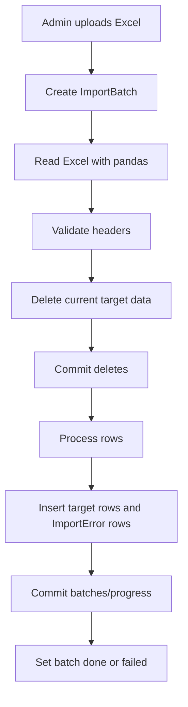
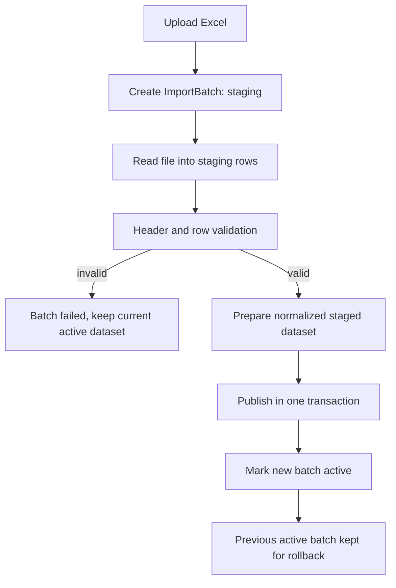

# طرح فنی تثبیت Import و جلوگیری از حذف داده موفق قبلی

تاریخ: 2026-06-02  
دامنه: importهای `codtafsiltamin`، `contractors-1` و `contractors-2` در backend اصلی.  
هدف: طراحی مسیر امن import با staging، validation کامل، publish نهایی و rollback، بدون پیاده‌سازی در این فاز.

---

## 1. وضعیت فعلی import

### codtafsiltamin

- ورودی: فایل Excel دایرکتوری پیمانکاران/تامین‌کنندگان.
- ستون‌های کلیدی: کد تامین‌کننده، نام تامین‌کننده، وضعیت، نوع، کد تفصیلی.
- جدول‌های تغییر یافته: `contractor`، `importbatch`، `importerror`.
- رفتار فعلی:
  - فایل با `pandas.read_excel` خوانده می‌شود.
  - headerها validate می‌شوند.
  - همه رکوردهای فعلی `Contractor` حذف می‌شوند.
  - خطاها و batchهای قبلی همین source حذف می‌شوند.
  - بعد از حذف‌ها `commit` انجام می‌شود.
  - سپس ردیف‌ها به `Contractor` تبدیل و درج می‌شوند.
  - خطاهای ردیفی در `ImportError` ثبت می‌شوند.
  - در انتها دوباره `commit` انجام می‌شود.
- رفتار در خطا:
  - خطای خواندن فایل یا header به `ValueError` تبدیل می‌شود.
  - خطای ردیفی باعث ثبت `ImportError` می‌شود.
  - چون حذف‌ها قبلاً commit شده‌اند، خطای بعد از حذف، داده قبلی را خودکار برنمی‌گرداند.

### contractors-1

- ورودی: فایل Excel خلاصه فاکتورها/روکش‌ها.
- ستون‌های کلیدی: شماره روکش و وضعیت فاکتور اجباری هستند؛ ستون‌های تاریخ، مبلغ، کارفرما، تامین‌کننده و مجوز با mapping از header فارسی خوانده می‌شوند.
- جدول‌های تغییر یافته: `invoicesummary`، `invoicedetail`، `importbatch`، `importerror`.
- رفتار فعلی:
  - فایل خوانده و headerها map می‌شوند.
  - همه `InvoiceSummary`ها حذف می‌شوند.
  - همه `InvoiceDetail`ها هم به‌عنوان داده وابسته حذف می‌شوند.
  - خطاها و batchهای قبلی همین source حذف می‌شوند.
  - بعد از حذف‌ها `commit` انجام می‌شود.
  - داده جدید به‌صورت batch/bulk درج می‌شود.
  - progress با `ImportBatch.update_progress` commit می‌شود.
  - برای فایل‌های بزرگ مسیر bulk/COPY-like استفاده می‌شود، اما همچنان commitهای میانی وجود دارد.
- رفتار در خطا:
  - نبود ستون اجباری قبل از حذف‌ها fail می‌شود.
  - خطای ردیفی به `ImportError` تبدیل می‌شود.
  - خطای بعد از حذف/commit می‌تواند دیتاست قبلی را از بین ببرد.

### contractors-2

- ورودی: فایل Excel جزئیات فاکتور/روکش.
- ستون‌های کلیدی: شماره/روکش، تاریخ، تامین‌کننده، مبلغ ناخالص.
- جدول‌های تغییر یافته: `invoicedetail`، `importbatch`، `importerror`؛ برای lookup از `invoicesummary` می‌خواند.
- رفتار فعلی:
  - فایل خوانده و ستون‌ها با alias resolve می‌شوند.
  - همه `InvoiceDetail`ها حذف می‌شوند.
  - خطاها و batchهای قبلی همین source حذف می‌شوند.
  - بعد از حذف‌ها `commit` انجام می‌شود.
  - برای استخراج `detail_code` و `supplier_code`، `InvoiceSummary`های مرتبط با cover_number خوانده می‌شوند.
  - داده جدید batch/bulk درج و progress commit می‌شود.
- رفتار در خطا:
  - نبود ستون اجباری قبل از حذف‌ها fail می‌شود.
  - خطای ردیفی به `ImportError` تبدیل می‌شود.
  - خطای بعد از حذف/commit، جزئیات قبلی را خودکار برنمی‌گرداند.

---

## 2. ریسک‌های فعلی

| ریسک | شدت | توضیح |
|---|---:|---|
| حذف و commit داده قبلی قبل از تکمیل import | زیاد | اگر import وسط کار fail شود، آخرین دیتاست موفق از دست می‌رود. |
| نبود snapshot یا active batch | زیاد | سیستم نمی‌تواند بداند کدام batch آخرین نسخه موفق و قابل برگشت است. |
| حذف batch/error history | متوسط/زیاد | بررسی audit، مقایسه batchها و rollback دشوار می‌شود. |
| وابستگی `contractors-2` به summaryهای موجود | متوسط | اگر `contractors-1` ناقص یا تازه حذف شده باشد، detailها بدون کدهای پیمانکار وارد می‌شوند. |
| commitهای progress در مدل import | متوسط | progress tracking با transaction داده مخلوط است و atomic بودن publish را سخت می‌کند. |
| نبود validation کامل قبل از publish | زیاد | بخشی از داده ممکن است درج شود و خطاهای ردیفی بعداً مشخص شوند. |

---

## 3. نقشه جریان فعلی داده

نقطه خطر اصلی بین `Delete current target data` و `Commit deletes` است؛ از این لحظه به بعد، rollback معمولی دیگر دیتاست قبلی را بازنمی‌گرداند.

---

## 4. طراحی پیشنهادی import امن

### اصل طراحی

داده production فقط بعد از موفقیت کامل خواندن، validation و آماده‌سازی نسخه جدید تغییر کند. هیچ import ناموفق نباید آخرین دیتاست موفق را خراب کند.

### جریان پیشنهادی

### مراحل

1. `staging`: فایل خوانده شود و raw rows با `batch_id` در جدول staging یا snapshot ذخیره شود.
2. `validating`: همه headerها، typeها، تاریخ‌ها، عددها، کلیدهای join و duplicateها بررسی شوند.
3. `ready_to_publish`: فقط اگر خطای blocking وجود ندارد، batch قابل publish شود.
4. `publishing`: در یک transaction کوتاه، نسخه جدید فعال شود.
5. `done`: batch جدید active dataset شود.
6. `failed`: داده فعلی بدون تغییر باقی بماند.

### rollback

- rollback باید فقط active pointer را به آخرین batch موفق قبلی برگرداند.
- rollback نباید نیازمند re-upload فایل قبلی باشد.
- rollback باید audit شود و فقط برای staff/admin مجاز باشد.

---

## 5. مدل دیتابیس پیشنهادی

این بخش طراحی است و migration در این فاز ساخته نمی‌شود.

### گزینه کم‌ریسک پیشنهادی: versioned production rows

افزودن ستون‌های versioning به جدول‌های هدف:

- `import_batch_id` یا استفاده ساختاریافته از `last_update_batch_id` برای `InvoiceSummary` و `InvoiceDetail`.
- `is_active` برای تعیین رکوردهای فعال.
- `deactivated_at` اختیاری برای رکوردهای قدیمی.
- برای `Contractor` نیاز به ستون مشابه batch/version وجود دارد، چون اکنون batch tracking ندارد.

مزیت: queryهای فعلی با افزودن filter فعال قابل حفظ هستند.  
ریسک: برای `Contractor` migration لازم می‌شود و همه queryها باید active-only شوند.

### گزینه ایمن‌تر برای publish: active dataset registry

افزودن جدول registry:

- `import_dataset`
  - `id`
  - `source`
  - `active_batch_id`
  - `previous_active_batch_id`
  - `activated_at`
  - `activated_by`

و staging/snapshot برای هر source:

- `staging_contractors`
- `staging_invoice_summaries`
- `staging_invoice_details`

یا یک جدول عمومی raw/staged با payload JSON و ستون‌های normalized اصلی.

مزیت: rollback با تغییر pointer انجام می‌شود.  
ریسک: queryهای runtime باید از active batch یا view فعال بخوانند.

### پیشنهاد اجرایی

برای این پروژه، مسیر مرحله‌ای بهتر است:

1. اول staging tables و validation اضافه شود، بدون تغییر رفتار خواندن production.
2. بعد publish transaction اضافه شود.
3. بعد active dataset registry و rollback اضافه شود.
4. در نهایت delete کامل داده قدیمی حذف و retention policy جایگزین شود.

---

## 6. تغییرات لازم در backend

- جدا کردن importerها به سه مرحله مفهومی:
  - `read_and_map`
  - `validate`
  - `publish`
- حذف commitهای داده از داخل حلقه‌های row processing.
- جدا کردن progress commit از transaction publish، به شکلی که progress نتواند داده production را نیمه‌کاره commit کند.
- افزودن validationهای blocking:
  - headerهای اجباری.
  - خالی نبودن کلیدهای join.
  - duplicateهای خطرناک.
  - تاریخ/عدد نامعتبر.
  - سازگاری `contractors-2` با summaryهای active.
- نگه داشتن `ImportError` برای همه خطاهای row-level، بدون حذف history قبلی.
- ایجاد service مستقل برای publish تا routeهای admin فقط orchestration کنند.

---

## 7. تغییرات لازم در admin upload API

- upload همچنان `batch_id` برگرداند.
- وضعیت‌های پیشنهادی:
  - `pending`
  - `staging`
  - `validating`
  - `ready_to_publish`
  - `publishing`
  - `done`
  - `failed`
  - `rolled_back`
- endpoint progress علاوه بر درصد، مرحله فعلی و تعداد خطاهای blocking/non-blocking را برگرداند.
- endpoint batch detail خطاهای validation و row errors را برگرداند.
- عملیات rollback به‌عنوان طراحی پیشنهادی:
  - `POST /admin/uploads/<batch_id>/rollback`
  - فقط staff/admin
  - فقط برای batch موفق قبلی یا active dataset قبلی
  - بدون پیاده‌سازی در این فاز

---

## 8. تست‌های لازم

### تست‌های واحد

- mapping header برای هر سه importer.
- validation ردیف‌های معتبر و نامعتبر.
- تضمین اینکه validation ناموفق هیچ delete یا publish انجام نمی‌دهد.
- ساخت contractor با مدل فعلی بدون فیلد نامعتبر.

### تست‌های integration با PostgreSQL

- import موفق `codtafsiltamin` و فعال شدن batch جدید.
- import ناموفق بعد از validation و باقی ماندن دیتاست فعال قبلی.
- import موفق `contractors-1` بدون حذف detail فعال قبلی تا زمان publish.
- import موفق `contractors-2` با lookup از summary فعال.
- rollback به batch موفق قبلی.
- RBAC: contractor نتواند upload/progress/rollback admin را صدا بزند.

### سناریوهای پذیرش

- اگر فایل جدید header اشتباه دارد، داده قبلی همچنان در dashboard دیده شود.
- اگر یک ردیف invalid است و policy آن blocking است، publish انجام نشود.
- اگر publish fail شود، active dataset قبلی باقی بماند.
- اگر rollback اجرا شود، dashboard همان داده batch قبلی را نشان دهد.

---

## 9. نقشه اجرای مرحله‌ای

### مرحله ۱: تثبیت بدون تغییر schema گسترده

- حذف bugهای واضح importer.
- افزودن تست‌های unit برای سازگاری مدل.
- مستندسازی دقیق وضعیت فعلی.

### مرحله ۲: validation قبل از حذف

- importerها ابتدا کل فایل را بخوانند و validate کنند.
- اگر validation blocking شکست خورد، هیچ delete انجام نشود.
- هنوز ممکن است publish قدیمی باقی بماند، اما ریسک شکست header/row قبل از حذف کاهش می‌یابد.

### مرحله ۳: staging tables

- افزودن migration برای staging یا snapshot.
- ذخیره raw و normalized rows با `batch_id`.
- نگه داشتن history batchها.

### مرحله ۴: publish transaction

- publish در transaction کوتاه و کنترل‌شده انجام شود.
- delete کامل با active/inactive یا batch pointer جایگزین شود.

### مرحله ۵: rollback و retention

- active dataset registry اضافه شود.
- rollback به batch قبلی پیاده‌سازی شود.
- retention policy برای batchها و staging rows تصویب و اجرا شود.

---

## 10. تصمیم‌هایی که نیازمند تأیید هستند

| تصمیم | گزینه پیشنهادی | دلیل |
|---|---|---|
| مدل versioning | active dataset registry + staging tables | rollback تمیزتر و audit بهتر |
| policy ردیف‌های خطادار | خطاهای کلیدی blocking باشند | جلوگیری از انتشار دیتاست ناقص |
| نگهداری batch history | حذف نشود تا retention تصویب شود | نیاز audit و rollback |
| rollback API | طراحی شود ولی بعد از staging/publish پیاده‌سازی شود | جلوگیری از پیچیدگی زودهنگام |
| وابستگی contractors-2 به summaries | فقط با summary active publish شود | جلوگیری از detail بدون scope پیمانکار |

